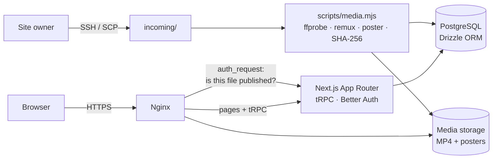

<div align="center">

<a href="https://bnds.life"></a>

# BNDS.life · 十一小日子

### A campus-life video site: a monthly timeline of longer videos, a swipeable short-clip feed, and a story behind every video

<b>English</b> · <a href="./README.zh-CN.md">简体中文</a>

**[Live site](https://bnds.life)** · [Media import guide](docs/media-import.md) · [Brand guide](docs/brand.md) · Feedback: TODO(Miles)


[](https://bnds.life)
[](LICENSE)

</div>

<!-- screenshot slot: docs/screenshots/home.png (home timeline, desktop, light mode, 16:9 PNG, about 1600 x 900; no identifiable people unless you have consent). Add as <a href="https://bnds.life"></a> -->
<!-- GIF slot (optional): docs/media/demo.gif (browse, play, then the 短拍 feed; about 800 px wide, 10 to 20 s, under 10 MB) -->

## ✨ Features

- 🗓️ **Monthly timeline** (`/`): videos longer than 60 s, grouped by shooting month with the newest first, plus official featured picks at the top.
- 📱 **短拍 short-clip feed** (`/recommend`): clips of 60 s or less in a vertical feed. Switch clips by scrolling, arrow keys or buttons; only the current clip plays. Layouts adapt from 9:16 to 16:9.
- 📖 **A story for every video** (`/watch/[id]`): the player plus an official story. On desktop the story opens beside the video; on mobile it opens in a drawer.
- 💬 **Accounts and comments**: email + password sign-up. Users comment and reply; the `official` role writes stories, edits video info, manages featured picks and takes videos offline.
- 🔎 **Search** (`/search?q=`): searches every video, regardless of category.
- 🎞️ **Lossless, curated media**: no public upload. The owner imports videos with an offline CLI that remuxes without re-encoding (HEVC Main 10, HLG and Dolby Vision metadata survived the first batch), strips private camera metadata, extracts posters and deduplicates by SHA-256.
- 🎨 **Four-color brand and dark mode**: blue `#006ECF` for actions, red `#F22A1A` for playback, orange `#FF8500` for notices, green `#73B338` for success. The theme follows the system and remembers your choice.

<!-- screenshot slots, one per feature (show them in a table or one by one):
  docs/screenshots/short-feed-mobile.png (短拍 feed on a phone, portrait PNG, about 1170 x 2532, shown at width 260)
  docs/screenshots/watch-story.png (watch page with the story panel, desktop, 16:9 PNG, about 1600 x 900)
  docs/screenshots/dark-mode.png (home or watch page in dark mode, desktop, 16:9 PNG, about 1600 x 900)
-->

## 🌐 Live demo

Open **[https://bnds.life](https://bnds.life)**. Browsing and watching need no account. To comment, register with any email and password; no email verification is required. There is no shared demo account.

The site was first served from the temporary domain `xuesiyuan.com.cn` while the `bnds.life` ICP filing was in progress. That domain now redirects to `bnds.life`.

## 🏗️ Architecture



- Pages live in `src/app/` (`/`, `/watch/[id]`, `/recommend`, `/search`, `/login`, `/register`). The public catalog API is `src/server/api/routers/video.ts`, and `src/server/videos.ts` is the read-only catalog shared by all pages.
- `src/server/db/schema.ts` holds the Drizzle schema: auth tables plus `videos` and `video_assets`.
- Before Nginx serves a media file, it asks the app to confirm the file belongs to a currently published video. Taken-down media is kept for 7 days and then removed by a scheduled job.

## 🧰 Tech stack

| Layer | Technology |
|---|---|
| Frontend | Next.js 15 (App Router) · React 19 · Tailwind CSS 4 · TanStack Query |
| API and auth | tRPC 11 · Better Auth (email + password) · Zod |
| Data | PostgreSQL · Drizzle ORM |
| Media | FFmpeg / FFprobe · Node.js CLI (`scripts/media.mjs`) |
| Ops | Nginx · systemd · Let's Encrypt (auto-renew) |
| Scaffold | [Create T3 App](https://create.t3.gg/) 7.40 · pnpm |

## 🚀 Getting started

Prerequisites: Node.js, pnpm, and Docker (e.g. OrbStack) for the local PostgreSQL. Last verified with Node.js 26.9.0, pnpm 12.4.2 and PostgreSQL 18.6.

```sh
pnpm install
cp .env.example .env        # first clone only; don't overwrite an existing .env
./start-database.sh         # starts local PostgreSQL
pnpm db:push                # sync the schema
pnpm dev                    # http://localhost:3000
```

| Variable | Required | Description |
|---|---|---|
| `DATABASE_URL` | yes | PostgreSQL connection string |
| `BETTER_AUTH_SECRET` | in production | Auth secret; generate with `openssl rand -base64 32` |
| `BETTER_AUTH_URL` | no | Site origin (default `http://localhost:3000`) |
| `VIDEO_CATALOG_MODE` | no | `demo` (default, placeholder media) or `database` (real catalog) |
| `MEDIA_ROOT` | for media tools | Private media root, never inside `public/` |

Development uses a demo catalog with placeholder media that contains no real people or campus footage. Checks: `pnpm test` (unit), `pnpm test:media` (needs FFmpeg and local PostgreSQL), `pnpm check` (`next lint` + `tsc --noEmit`) and `pnpm build`.

## 📦 Deployment

Production runs on a single Linux server: Nginx terminates HTTPS (Let's Encrypt, auto-renewed) and proxies to the Next.js app, which is managed by systemd as an unprivileged user and backed by a local PostgreSQL. Each release is built in its own `releases/<commit>` directory and switched in atomically, and the previous release is kept for rollback. Videos are uploaded over SSH and imported with `pnpm media`; see [`docs/media-import.md`](docs/media-import.md).

## 🗺️ Roadmap · Contributing

- [x] Monthly timeline, 短拍 feed, stories, accounts and comments, featured picks
- [x] Lossless media pipeline and production deployment at bnds.life
- [ ] TODO(Miles): next steps you are happy to share publicly

This is a personal project and is not open to outside contributions right now. <!-- TODO(Miles): adjust if the repo goes public. -->

## 📄 License

The source code is released under the [MIT License](LICENSE).

Campus videos, stories and other media shown on bnds.life are not covered by the code license; all rights remain with their owners.

## 🙏 Acknowledgements

Designed, built and operated by Miles Xue. Bootstrapped with [Create T3 App](https://create.t3.gg/). The "Play List" navigation icon comes from Streamline (see `public/icons/`). The layout takes cues from mainstream video sites without copying their branding. The logo is AI-assisted: it started from an AI-generated source image, and the transparent and dark-background versions were made with AI image edits (see [`docs/brand-logo-edit.md`](docs/brand-logo-edit.md)).
<!-- TODO(Miles): confirm the Streamline icon license wording. -->
