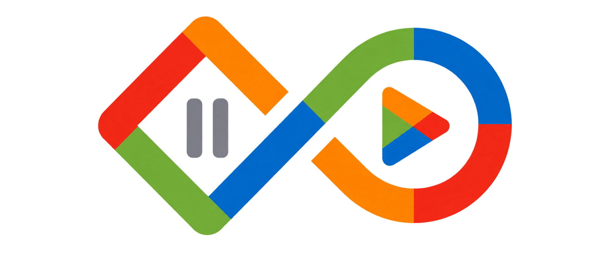
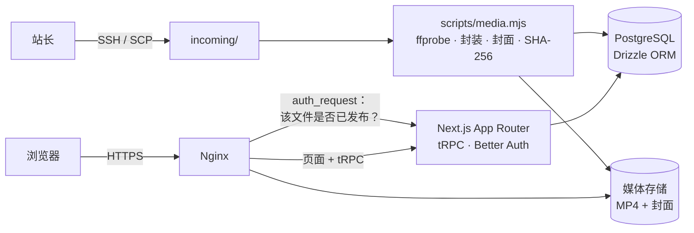

<!-- 术语表（修改中文版前请先对照）：产品名统一写作 bnds.life（全小写，中英文一致），不再使用中文名；短拍=推荐页短视频流（/recommend）；故事=官方为视频撰写的说明文字；精选=首页 official 精选；official=官方账号角色，保持英文；下线=take down；媒体导入=media import；Next.js、App Router、tRPC、Better Auth、Drizzle、PostgreSQL、Nginx、systemd、Let's Encrypt 等名称不翻译。人称统一用“你”，引号统一用「」。 -->

<div align="center">

<a href="https://bnds.life"></a>

# bnds.life

### 记录校园日常的视频站：长视频按月成册，短视频上下滑动，每段影像都有它的故事

<a href="./README.md">English</a> · <b>简体中文</b>

**[访问网站](https://bnds.life)** · [媒体导入说明](docs/media-import.md) · [品牌规范](docs/brand.md) · 反馈渠道：TODO(Miles)


[](https://bnds.life)
[](LICENSE)

</div>

<!-- 截图位：docs/screenshots/home.png（首页时间线，电脑端浅色模式，16:9 PNG，约 1600 × 900；除非已取得同意，请选用无法辨认具体人物的画面）。添加方式：<a href="https://bnds.life"></a> -->
<!-- GIF 位（可选）：docs/media/demo.gif（浏览、播放，再进入短拍；宽约 800 px，10～20 秒，小于 10 MB） -->

## ✨ 功能特性

- 🗓️ **按月成册**（`/`）：时长超过 60 秒的视频按拍摄月份分组，最新的在前；顶部展示 official 精选。
- 📱 **短拍**（`/recommend`）：60 秒以内的短视频竖向排列，可用滚动、方向键或按钮切换，只播放当前一条；画幅在 9:16 到 16:9 之间自适应。
- 📖 **一段视频，一个故事**（`/watch/[id]`）：播放器旁附有官方撰写的故事；电脑端在视频侧边展开，手机端以抽屉形式弹出。
- 💬 **账号与评论**：邮箱加密码即可注册。普通用户可以评论和回复；official 负责撰写故事、修改视频信息、管理精选和下线视频。
- 🔎 **全站搜索**（`/search?q=`）：搜索全部视频，不受首页和短拍分类限制。
- 🎞️ **无损、精选的影像**：网站不开放上传。站长用离线命令行工具导入视频：不重新编码，只封装（首批视频的 HEVC Main 10、HLG 和 Dolby Vision 信息都完整保留），去除相机私有元数据，自动截取封面，并按 SHA-256 去重。
- 🎨 **四色品牌与深色模式**：蓝 `#006ECF` 表示可操作，红 `#F22A1A` 表示播放，橙 `#FF8500` 表示提示，绿 `#73B338` 表示完成；主题默认跟随系统，并记住你的选择。

<!-- 截图位，每个功能一张（可放进表格，也可逐张展示）：
  docs/screenshots/short-feed-mobile.png（手机端短拍，竖屏 PNG，约 1170 × 2532，显示宽度 260）
  docs/screenshots/watch-story.png（带故事面板的观看页，电脑端，16:9 PNG，约 1600 × 900）
  docs/screenshots/dark-mode.png（深色模式下的首页或观看页，电脑端，16:9 PNG，约 1600 × 900）
-->

## 🌐 在线体验

打开 **[https://bnds.life](https://bnds.life)**，浏览和观看都无需登录。想发表评论的话，用任意邮箱和密码注册即可，无需邮箱验证。网站不提供公用演示账号。

`bnds.life` 备案期间，网站曾临时使用 `xuesiyuan.com.cn`；该域名现已自动跳转到 `bnds.life`。

## 🏗️ 架构



- 页面位于 `src/app/`（`/`、`/watch/[id]`、`/recommend`、`/search`、`/login`、`/register`）。公开的目录接口是 `src/server/api/routers/video.ts`，`src/server/videos.ts` 是各页面共用的只读视频目录。
- `src/server/db/schema.ts` 定义 Drizzle 数据表：账号相关表，以及 `videos`、`video_assets`。
- Nginx 返回媒体文件前，会先请应用确认该文件属于当前已发布的视频。下线的媒体保留 7 天，之后由定时任务清理。

## 🧰 技术栈

| 层级 | 技术 |
|---|---|
| 前端 | Next.js 15（App Router） · React 19 · Tailwind CSS 4 · TanStack Query |
| 接口与认证 | tRPC 11 · Better Auth（邮箱 + 密码） · Zod |
| 数据 | PostgreSQL · Drizzle ORM |
| 媒体 | FFmpeg / FFprobe · Node.js 命令行工具（`scripts/media.mjs`） |
| 运维 | Nginx · systemd · Let's Encrypt（自动续期） |
| 脚手架 | [Create T3 App](https://create.t3.gg/) 7.40 · pnpm |

## 🚀 本地开发

需要 Node.js、pnpm，以及运行本地 PostgreSQL 用的 Docker（例如 OrbStack）。最近一次验证使用 Node.js 26.9.0、pnpm 12.4.2 和 PostgreSQL 18.6。

```sh
pnpm install
cp .env.example .env        # first clone only; don't overwrite an existing .env
./start-database.sh         # starts local PostgreSQL
pnpm db:push                # sync the schema
pnpm dev                    # http://localhost:3000
```

| 变量 | 是否必填 | 说明 |
|---|---|---|
| `DATABASE_URL` | 是 | PostgreSQL 连接串 |
| `BETTER_AUTH_SECRET` | 生产环境必填 | 认证密钥，可用 `openssl rand -base64 32` 生成 |
| `BETTER_AUTH_URL` | 否 | 站点地址（默认 `http://localhost:3000`） |
| `VIDEO_CATALOG_MODE` | 否 | `demo`（默认，演示素材）或 `database`（真实目录） |
| `MEDIA_ROOT` | 使用媒体工具时必填 | 私有媒体根目录，不能放在 `public/` 里 |

开发环境默认使用演示目录，素材中没有真实人物或校园画面。检查命令：`pnpm test`（单元测试）、`pnpm test:media`（需要 FFmpeg 和本地 PostgreSQL）、`pnpm check`（`next lint` + `tsc --noEmit`）和 `pnpm build`。

## 📦 部署

生产环境运行在一台 Linux 服务器上：Nginx 负责 HTTPS（Let's Encrypt 证书自动续期）并反向代理到 Next.js 应用；应用由 systemd 以无登录权限的专用用户运行，数据存放在本机 PostgreSQL。每次发布都在独立的 `releases/<提交号>` 目录中构建，构建成功后原子切换，并保留上一版本以便回滚。视频通过 SSH 上传后，用 `pnpm media` 导入，详见 [`docs/media-import.md`](docs/media-import.md)。

> 国内部署提示：服务器位于中国大陆时，域名须先完成 ICP 备案才能正常提供网站服务，备案号一般还要展示在页脚并链接到工信部备案系统。本站在 `bnds.life` 备案期间先使用已备案的临时域名，备案完成后再切换并设置跳转。<!-- TODO(Miles)：确认 bnds.life 备案已完成，并在网站页脚补上备案号。 -->

## 🗺️ 路线图 · 参与贡献

- [x] 按月时间线、短拍、故事、账号与评论、首页精选
- [x] 无损媒体导入流程，生产环境上线 bnds.life
- [ ] TODO(Miles)：你愿意公开的后续计划

这是个人项目，目前不接受外部贡献。<!-- TODO(Miles)：如果仓库公开，再调整这一段。 -->

## 📄 许可证

源代码以 [MIT 许可证](LICENSE) 发布。

bnds.life 上展示的校园视频、故事及其他媒体内容不在代码许可证的授权范围内，相关权利归各自的权利人所有。

## 🙏 致谢

由 Miles Xue 设计、开发和运维。项目基于 [Create T3 App](https://create.t3.gg/) 搭建。导航中的「Play List」图标来自 Streamline（见 `public/icons/`）。界面布局参考了主流视频网站，但没有使用它们的品牌元素。Logo 借助 AI 制作：源图由 AI 生成，透明背景版和深色背景版也通过 AI 图像编辑完成（见 [`docs/brand-logo-edit.md`](docs/brand-logo-edit.md)）。
<!-- TODO(Miles)：确认 Streamline 图标的许可说明。 -->
